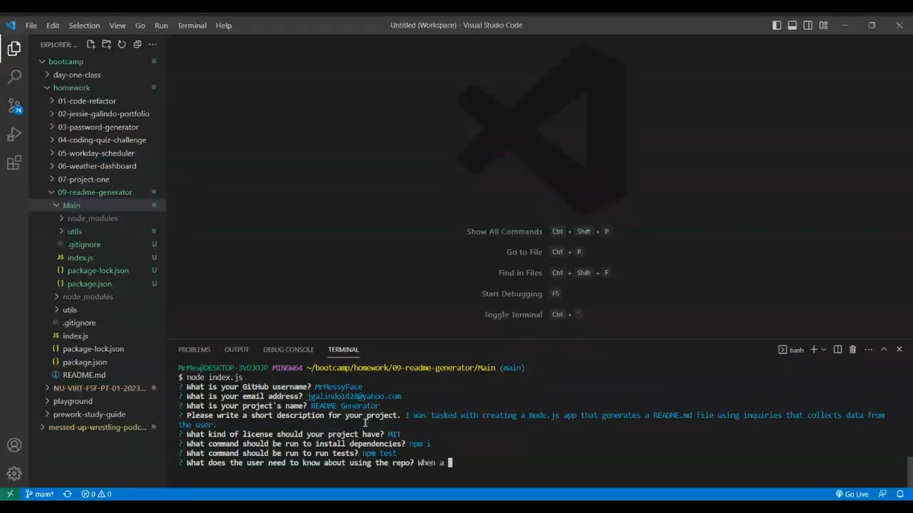

# README Generator

## Description

I was tasked with creating a Node.js app that generates a README.md file using inquiries that collects data from the user. I used Node.js and inquirer.

## Installation

In order to install this app, you would clone the [repository](https://github.com/MrMessyFace/readme-generator) from GitHub. After you have cloned the repository, you would type "npm i" into the terminal to install the NPM packages. After the packages are installed, you would type "node index.js" into the terminal to start the app.

## Usage

When a user starts the app, the terminal would ask a series of questions that will fill in the sections of the README.md file that will be generated.

## Credits

Starter code was provided by the Northwestern University Full Stack Coding Bootcamp but was updated based on activities that were worked on in class.

## Helpful Links

- [Repository](https://github.com/MrMessyFace/readme-generator)
- [Video Demonstration](https://drive.google.com/file/d/1v2Nm0KMaARYUonXva0OYrHRYJcORxgTZ/view)

&copy; 2023 Jessie S. Galindo. All Rights Reserved.
